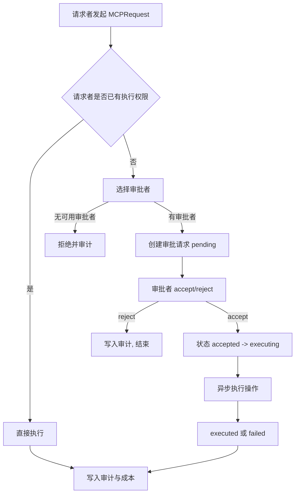

# UnixAgent 权限治理原型

UnixAgent 是一个“多 Agent 权限治理 + 成本约束 + 可审计执行”的原型系统。
它聚焦于：

- 把“谁能做什么”表达成可比较的权限对象；
- 把“谁批准、谁执行、何时执行”拆成可追踪的 MCP 请求流；
- 把“成本、风险、组织治理”统一纳入 root 可控策略。

---

## 1. 项目目标

在团队协作场景中，普通 Agent 往往需要临时越权完成任务（如写入敏感目录、执行 shell、调用外部工具）。
本项目通过如下机制降低失控风险：

1. **默认最小权限**：每个组和 Agent 只持有必要能力。
2. **越权走审批**：请求者与审批/执行者分离，形成治理闭环。
3. **权限可下放可收回**：支持按组、按动作、按权限子集精准拆分。
4. **全链路审计**：审批决策、执行结果、通信日志、成本流水可追溯。
5. **成本策略兜底**：root 可通过 `CostPolicy` 约束规模、权限与保险风险。

---

## 2. 核心特性

- 初始 `root` Agent 拥有完整系统管理、招募与审批能力。
- 用户组（`AgentGroup`）承载模板配置（system prompt / model / context window / group privileges）。
- 权限支持下放与收回（`HirePrivilege` / `ApprovalPrivilege` / 运行权限 / 外部工具权限）。
- 审批支持按“请求来源组 + 可审批权限集合 + 是否覆盖未来组”拆分。
- 治理操作（建组、改组、招募、剔除、授权、收权、成本策略更新）全部可走 MCP。
- 审批流为两阶段：
	- 阶段 1：创建审批请求并通知审批者；
	- 阶段 2：审批者 `accept/reject`，接受后异步执行落地。
- Agent 间支持单播与组播通信，并记录通信日志。
- 成本核算维度：
	- `food_tokens`：token 使用量；
	- `food_cost`：按模型每百万 token 单价折算；
	- `budget_api`：外部 API 预算；
	- `wage_compute`：计算工资（按时间持续累积）；
	- `insurance`：权限风险保费（由权限对象计算）。
- root 专属 `CostPolicy` 可限制：
	- 总 Agent 数；
	- 单组 Agent 数；
	- 总保险成本；
	- 单 Agent 权限数。
- 每个 Agent 使用 LangChain `ConversationSummaryBufferMemory` 管理记忆，受组级 `max_token_limit` 约束。
- MCP 执行器可插拔：本地模拟执行 / 真实 HTTP MCP 服务。

---

## 3. 快速开始

### 3.1 环境要求

- Python `>=3.14`（来自 `pyproject.toml`）
- Windows / Linux / macOS（示例命令以 PowerShell 为主）

### 3.2 安装依赖

推荐使用 `uv`：

```bash
uv sync
```

若你使用 `pip`，可按 `pyproject.toml` 手动安装核心依赖（如 `langchain`、`pydantic`、`pyyaml` 等）。

### 3.3 准备配置

确保项目根目录存在：

- `settings.yaml`
- `secrets.yaml`

`secrets.yaml` 建议加入忽略（避免泄漏密钥）。

### 3.4 启动方式

仅启动系统并初始化 root：

```bash
python .\main.py
```

运行完整治理演示：

```bash
python .\tmp\demo_mcp_flow.py
```

---

## 4. 最小配置模板

### 4.1 `settings.yaml`

```yaml
root:
	system_prompt: |
		You are root Agent. Minimize total cost and keep system safe.
	model_name: gpt-5.3-codex
	group_name: sudo
	agent_name: root
	context_window_limit: 8192

models:
	- gpt-5.3-codex
	- gpt-4.1-mini

mcp:
	executor: dry-run
```

### 4.2 `secrets.yaml`

```yaml
model_bindings:
	gpt-5.3-codex:
		api_url: "https://your-endpoint/v1"
		api_key: "YOUR_KEY"
		parameter_count: 0
		price_per_million_tokens: 3.0

	gpt-4.1-mini:
		api_url: "https://your-endpoint/v1"
		api_key: "YOUR_KEY"
		parameter_count: 0
		price_per_million_tokens: 0.8
```

字段说明：

- `api_url`：模型调用地址（HTTP MCP 执行器会使用执行 Agent 的该地址）。
- `api_key`：访问密钥（会自动拼接为 `Authorization: Bearer ...`）。
- `parameter_count`：模型参数规模（用于统计/展示）。
- `price_per_million_tokens`：每百万 token 价格，用于计算 `food_cost`。

---

## 5. 运行流程总览



审批请求状态流转：

- `pending`
- `accepted` / `rejected`
- `executing`
- `executed` / `failed`

---

## 6. 权限模型

### 6.1 运行权限

- `IOPrivilege`：文件读写/提权控制（路径白名单/黑名单语义）。
- `ShellPrivilege`：shell 命令执行控制（命令模式 + sudo 控制）。
- `ExternalToolPrivilege`：外部工具名级别的调用权限控制。

### 6.2 治理权限（组织管理）

- `HirePrivilege`
	- `allowOperations`：可执行治理动作（如 `ADD`、`REMOVE`、`ADDGROUP`、`MODIFYGROUP`、`GIVEPRIVILEGE`、`REVOKEPRIVILEGE` 等）。
	- `allowTargetAgentGroup`：可操作的目标组集合。
	- `allowAllCurrentAndFutureGroups`：是否覆盖当前与未来组。

### 6.3 审批权限（审批域）

- `ApprovalPrivilege`
	- `allowTargetAgentGroup`：允许向自己提审批请求的来源组。
	- `allowAllCurrentAndFutureGroups`：是否覆盖未来新增组。

### 6.4 关键语义

系统会同时校验审批者是否满足：

1. 审批域覆盖该请求；
2. 自身具备该请求所需执行权限。

这避免“有审批权但无法落地执行”的逻辑漏洞。

---

## 7. 成本与策略

### 7.1 成本组成

- `food_tokens`：统计 token 数。
- `food_cost`：`food_tokens / 1_000_000 * price_per_million_tokens`。
- `budget_api`：外部 API 预算累计。
- `wage_compute`：按秒累计（空闲也增长）。
- `insurance`：Agent 所有权限对象风险保费之和。

### 7.2 `CostPolicy`（root 专属）

root 可动态设置：

- `max_total_agents`
- `max_group_agents`
- `max_total_insurance`
- `max_privileges_per_agent`

策略在招募与授权时强制生效，超限直接拒绝并返回错误。

---

## 8. 核心模块与职责

- `agentGroup/agentGroup.py`
	- `Agent`：单体执行者（权限、成本、记忆）。
	- `AgentGroup`：组模板、成员管理、审批执行核心。
	- `MCPRequest` / `MCPResult`：请求与结果载体。
	- `ApprovalRequestEntry`：异步审批请求记录。
	- `audit_log` / `message_log`：审计与通信日志。
	- `CostPolicy`：全局成本治理策略。

- `operation.py`
	- `Operation` 抽象层：统一 `required_privilege`、`payload`、`execute`。
	- 运行操作：`FileOperation`、`ShellOperation`、`ExternalToolOperation`。
	- 治理操作：`CreateGroupOperation`、`UpdateGroupOperation`、`RecruitAgentOperation`、`UpdateCostPolicyOperation` 等。

- `privilege/`
	- `operations.py`：`IOPrivilege`、`ShellPrivilege`。
	- `approval.py`：`ApprovalPrivilege`。
	- `hire.py`：`HirePrivilege` + `HireOperation`。
	- `external_tool.py`：`ExternalToolPrivilege`。

- `agentGroup/memory.py`
	- LangChain `ConversationSummaryBufferMemory` 创建与序列化工具。

- `agentGroup/mcp_executor.py`
	- `MCPToolExecutor` / `DryRunMCPToolExecutor` / `HttpMCPToolExecutor`。
	- `ExternalToolCaller` / `DryRunExternalToolCaller`。

---

## 9. 演示脚本内容（`tmp/demo_mcp_flow.py`）

脚本覆盖以下完整路径：

1. root 创建 `memberA/leaderA/memberB/leaderB`。
2. root 下放分组审批权、执行权、治理权、外部工具调用权。
3. `memberA` 发起 `workspaceA` 越权操作并由 `leaderA` 审批执行。
4. `memberA` 请求 `workspaceB` 操作：
	 - 指定 `leaderA`（被拒）；
	 - 指定 `root`（成功）。
5. `leaderA` 使用被下放的 `HirePrivilege` 招募新成员。
6. 输出成本报告、审计日志。
7. 演示外部工具权限验证与执行。
8. 演示状态持久化与重载。
9. 演示 root 更新成本策略并触发超限拒绝。

---

## 10. 常用编程接口

### 10.1 启动系统

```python
from main import bootstrap_system

root = bootstrap_system()
```

### 10.2 配置 MCP 执行器

```python
from agentGroup import AgentGroup, DryRunMCPToolExecutor, HttpMCPToolExecutor

# 本地模拟（默认）
AgentGroup.configure_mcp_executor(DryRunMCPToolExecutor())

# 真实 HTTP MCP
AgentGroup.configure_mcp_executor(HttpMCPToolExecutor(timeout_seconds=20.0))
```

### 10.3 发起请求并审批

```python
from pathlib import Path
from agentGroup import AgentGroup, MCPRequest
from operation import FileOperation

request = MCPRequest(
		requester=some_agent,
		action="write config",
		required_privileges=[],
		operation=FileOperation(
				action="write config",
				target_path=Path("workspaceA/config.yaml"),
				write=True,
				sudo=False,
		),
)

result = AgentGroup.execute_via_mcp(request)
if result.approval_request_id:
		AgentGroup.approve_request(
				approver=some_approver,
				request_id=result.approval_request_id,
				accept=True,
				reason="scope matched",
		)
```

### 10.4 保存与加载状态

```python
from pathlib import Path
from agentGroup import AgentGroup

path = AgentGroup.save_state(Path("tmp/agent_state.json"))
AgentGroup.load_state(path)
```

持久化包含：

- 用户组与组权限模板；
- Agent 成员、Agent 权限、成本台账、记忆摘要；
- 审计日志与通信日志；
- root 组索引与成本策略。

---

## 11. 冷启动与边界说明

- 冷启动限制：首次只允许初始化 root 组 + root Agent。
- 其他组必须在系统启动后由 root 通过治理操作创建。
- 审批执行默认异步：`approve_request(accept=True)` 返回后，实际执行在后台线程进行。
- 如果你切换到真实 HTTP MCP，请确保执行 Agent 对应模型绑定已配置可用 `api_url` 和 `api_key`。

---

## 12. 常见问题（FAQ）

### Q1：为什么请求被拒绝，提示没有 approver？

通常是因为系统找不到同时满足以下条件的审批者：

1. 对请求来源组有审批域；
2. 拥有请求所需执行权限。

### Q2：为什么指定了审批者仍然拒绝？

指定审批者会强约束目标人选；若该审批者不满足“审批域 + 执行权”双条件，系统会直接拒绝，不会再自动兜底选择其他人。

### Q3：为什么 Agent 空闲时成本还增长？

`wage_compute` 按时间累积，这是设计目标，用于模拟“资源占用成本”。

### Q4：为什么授权/招募突然失败？

可能触发了 root 设置的 `CostPolicy` 限制（总人数、组人数、保费上限、单 Agent 权限上限）。

---

## 13. 项目结构

```text
.
├─ main.py
├─ config.py
├─ operation.py
├─ settings.yaml
├─ secrets.yaml
├─ agentGroup/
│  ├─ agentGroup.py
│  ├─ mcp_executor.py
│  └─ memory.py
├─ privilege/
│  ├─ approval.py
│  ├─ hire.py
│  ├─ operations.py
│  ├─ external_tool.py
│  └─ privilege.py
└─ tmp/
	 ├─ demo_mcp_flow.py
	 ├─ agent_state.json
	 └─ msg_state.json
```

---

## 14. 一句话总结

UnixAgent 的核心不是“让 Agent 拥有更多权限”，而是“让权限、审批、执行、成本、审计全部可治理”。
